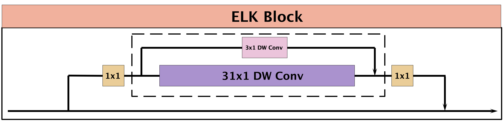
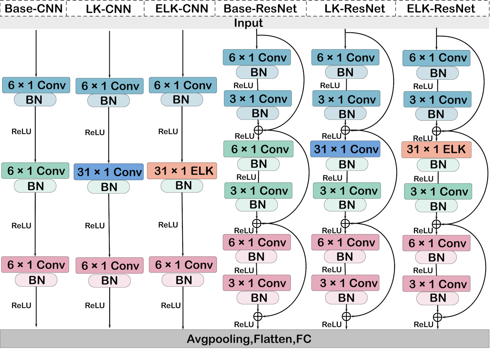

# ELK-HAR

[](https://github.com/MinghuiYao/ELK-HAR/actions/workflows/ci.yml)
[](https://www.python.org/)
[](https://pytorch.org/)

Reference implementation of **An Effective Large Kernel Convolutional Neural
Network for Human Activity Recognition Using Wearables**.





ELK-HAR trains a large depthwise kernel together with a small local branch and
fuses convolution/batch-normalization parameters into one convolution for
inference.

## Installation

```bash
git clone https://github.com/MinghuiYao/ELK-HAR.git
cd ELK-HAR
python -m pip install -e .
```

## Quick start

```python
import torch
from elk_har import ELKCNN

model = ELKCNN(input_shape=(1, 128, 9), num_classes=6).eval()
inputs = torch.randn(8, 1, 128, 9)
with torch.no_grad():
    logits = model(inputs)
    model.structural_reparameterize()
    deployment_logits = model(inputs)

torch.testing.assert_close(logits, deployment_logits, atol=1e-5, rtol=1e-4)
```

Input order is `[batch, channel, time, modalities]`. Run
`python examples/quickstart.py` for a standalone fusion check.

## Correctness notes

The original `ELK` constructor defaulted to `small_kernel_merged=True`, which
created only a single large convolution during training and silently omitted
the supplied small kernel. Its fusion path also subtracted tuple kernel sizes,
which raised an exception for the documented `(31, 1)`/`(3, 1)` configuration.
The maintained implementation trains both branches by default and performs
axis-aware padding during fusion. Regression tests verify numerical equivalence.

Legacy imports from `ELK_block.py` and `Model.py` remain available.

## Artifact scope

Model code, packaging, tests, CI, and reparameterization checks are included.
Dataset pipelines, fixed subject splits, training recipes, checkpoints, and
paper result tables remain follow-up artifacts; see
[docs/reproducibility.md](docs/reproducibility.md).

## Citation

```bibtex
@software{yao_elk_har_2023,
  author = {Yao, Minghui},
  title  = {An Effective Large Kernel Convolutional Neural Network for Human Activity Recognition Using Wearables},
  year   = {2023},
  url    = {https://github.com/MinghuiYao/ELK-HAR}
}
```

## License status

No open-source license has been declared. Until the copyright holder adds one,
the repository does not grant general permission to copy, modify, or redistribute the code.
